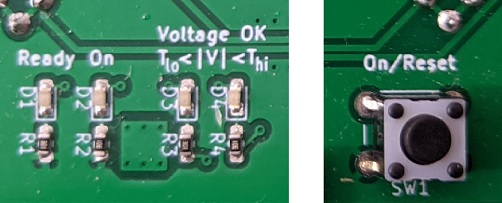

# Voltmitten

is a configurable, modular, chainable DC voltage monitoring device that will
cut off all power to a load if the voltage on any of several power supply
channels goes too high or too low. Voltmitten is meant to protect vintage
electronics if their old power supplies malfunction and attempt to send
damaging voltages into sensitive circuits.

It may not be surprising that "overvoltage" failures like [this one involving
an HP9825T desktop calculator](https://www.youtube.com/watch?v=b-eN93L6yX8) or
[this one in an Intel MDS-800 power supply](
https://www.youtube.com/watch?v=ySch60wRA6g&t=240s) can destroy electronic
components like integrated circuits. "Undervoltage" failures (e.g. one of the
power supply outputs shutting down altogether) can also be destructive, as
[this video](https://www.youtube.com/watch?v=Nh081qukI0g&t=313s) explains.
Voltmitten aims to protect against both failure types by monitoring and
switching up to four power supply channels. Two of those channels can supply
negative voltages. Up to eight channels (with up to four negative voltages) may
be protected if you chain two Voltmittens together.


Voltmitten is

* **modular** -- individual power supply channels are handled by separate
  modules that plug into a backplane, allowing for simple reconfiguration.

* **configurable** -- power supply channel modules may be customised for a wide
  range of high and low threshold voltages.

* **chainable** -- chain multiple Voltmittens together for power supplies with
  more than four channels.


## Fair warning

This hardware design and all other materials distributed alongside it are made
available for free with NO WARRANTY OF ANY KIND. Any system or device that
interfaces with hardware built from this design could suffer malfunction, data
loss, physical damage, or other harms. Some of these effects could be permanent
and/or unrepairable. If you're not prepared to risk these consequences, don't
use these resources.


## Table of contents

* [Is Voltmitten ready for my application?](
  #is-voltmitten-ready-for-my-application)
* [An overview of Voltmitten in pictures](
  #an-overview-of-voltmitten-in-pictures)
* [Assembly notes](#assembly-notes)
* [Operation](#operation)
   - [Setup](#setup)
   - [Usage](#usage)
      - [An ordinary usage cycle](#an-ordinary-usage-cycle)
      - [Exceptions to ordinary usage](#exceptions-to-ordinary-usage)
      - [Ganged operation](#ganged-operation)
* [How does Voltmitten work? (A tour of the schematic)](
  #how-does-voltmitten-work-a-tour-of-the-schematic)
   - [Positive voltage channel module](#positive-voltage-channel-module)
   - [Negative voltage channel module](#negative-voltage-channel-module)
   - [The backplane](#the-backplane)
* [Other notes](#other-notes)
* [Acknowledgements](#acknowledgements)
* [Revision history](#revision-history)


## Is Voltmitten ready for my application?

Voltmitten was designed as a hobby project by an enthusiast without formal
training in electronics. There are many things that would be good to know about
Voltmitten before you depend on it to safeguard a precious device. If you can
find or design a more trustworthy device than Voltmitten, you should buy or
build that one instead. If not and Voltmitten is your only option, here's what
you should know, along with what's not known:

**Voltmitten has never had a "save".** So far, a pair of Voltmittens have been
monitoring the +12V, +8.5V, +5V, -5V, and -12V supply inputs to the main logic
assembly inside an [IBM 5100 portable computer](
https://en.wikipedia.org/wiki/IBM_5100). The decades-old power supply in this
computer hasn't failed yet, so there's been no demonstration of Voltmitten
protecting an actual electronic device. Of course Voltmitten was tested in an
experimental test setup with artificial loads, where it worked as intended.

**Voltmitten timing remains uncharacterised.** Although Voltmitten uses only
solid-state parts that sense and switch quickly, nobody has measured (for
example) how fast Voltmitten responds to voltage excursions, or whether its
response time differs between modules that switch power supply channels with
different voltages. The designs of Voltmitten positive and negative channel
modules differ considerably, so there is reason to expect that switch-on and
switch-off times may also vary between these modules in particular. This may be
extremely important to your application: for further thoughts, see
[SEQUENCING.md](SEQUENCING.md).

**Voltmitten's upper limits are unknown.** Although certain performance bounds
can be inferred from the datasheets for Voltmitten's components, no effort has
been made to determine whether Voltmitten can work for voltages larger than the
fairly ordinary ones required by the IBM 5100 mentioned above, nor has anyone
determined what Voltmitten's current, power, or thermal limits are.

**Voltmitten's mechanical shortcomings are unknown.** As a modular design with
separate connectors for inputs, outputs, and operating power, Voltmitten may be
susceptible to malfunction if it is shaken or jarred, or it could grow less
reliable as its connectors wear and tarnish over time. Nobody has investigated
how great these risks could be.

**It's not known how well Voltmitten tolerates non-resistive loads.** There are
[three main categories of electric loads](
https://electronics.stackexchange.com/questions/91975/what-does-load-mean-and-what-are-the-different-types),
where each refers to a way that the load reacts to changes in electrical
current or voltage. A resistive load is the simplest type, as it has no
significant reaction to such changes (so, basically, it behaves like a
resistor). The other two types are more complicated to deal with, since their
reactions to changes can include temporary current or voltage spikes.
Voltmitten switching electrical power on or off certainly yields a change in
voltage or current, and if the load has a big enough reaction, it could damage
certain Voltmitten components.

Roughly speaking, devices that are "mostly electronics" (ICs and similar
devices) are probably mostly resistive loads, whilst loads that involve motors,
solenoids, or capacitor banks are more likely to have non-resistive
characteristics.

**Voltmitten won't protect against voltage inversions.** If something goes very
wrong in your power supply and a positive voltage channel becomes negative with
respect to ground, or if a negative voltage channel becomes positive with
respect to ground, then Voltmitten won't be able to block the resulting
reversed current flow --- even in the likely case that the electronic switching
devices on the modules are open, or even if Voltmitten is powered off! These
switches contain reverse-biased diodes that allow current moving in the "wrong"
direction to pass through regardless of the switch's state. 

**Voltmitten has not been used for very long.** There's no test like the test
of time, and Voltmitten simply hasn't had a chance to pass it yet.


## An overview of Voltmitten in pictures


This image shows two Voltmitten devices in a tandem arrangement: together they
can monitor up to eight separate voltage channels. Voltmitten comprises long,
narrow "voltage channel modules" that plug into a rectangular backplane. The
backplane hosts monitoring and control logic, the power supply, and the "user
interface" (i.e. four LEDs and a pushbutton). (The backplane actually sits on
top of the voltage channel modules.) Prominent features from top to bottom
include:

* **Power connectors**. These connectors receive power from the power supply
  and send switched output power to the load. Each voltage channel module
  is responsible for one of the power supply's supply voltages, and each has
  two identical connectors for greater current carrying capacity.

* **Heat dissipation zone**. Voltmitten's solid-state power switches can
  generate heat when they pass a significant amount of current. The areas of
  bare metal radiate much of this heat. ***Note: each of these areas is also
  a conductor for one of the inputs from the power supply, and so different
  voltage channel modules have bare conductors at different potentials. Do not
  allow stray pieces of metal or other conductive materials to short any of
  these areas together!***

* **Solid-state switches**. The large black components are the switching
  devices that either block current or allow it to pass through Voltmitten.
  Voltage channel modules that switch negative voltages happen to use a
  larger device than positive modules, but their current-carrying
  capacities are not very different.

* **Backplane connectors**. Two header connectors at an unusual angle (not
  seen here, but the places where they are soldered to the backplane are
  visible) connect each voltage channel module to the backplane.

* **USB power**. Voltmitten's monitoring and control circuitry is powered by
  externally-supplied +5V power delivered through a USB micro-B connector.

* **LED indicators**. From left to right, when illuminated, these four LEDs
  mean:
  - Ready: Voltmitten is receiving USB power.
  - On: Voltmitten is allowing power to flow from the power supply to the load.
  - Voltage OK Tₗₒ < |V|: No undervoltage condition exists.
  - Voltage OK |V| < Tₕᵢ: No overvoltage condition exists:

* **On/Reset button**. Press this button to tell Voltmitten to allow current to
  begin flowing from the power supply to the load. Voltmitten will obey as long
  as no overvoltage condition exists. As long as no undervoltage condition
  exists either, Voltmitten will continue to allow current to flow after the
  button is released.


Further details from a close-up view of the Voltmitten backplane:

* **Cat hair**. Design and testing assistance from Shrigley the cat is
  gratefully acknowledged.

* **Voltage monitoring IC**. The [LTC2914 quad voltage monitor](
  https://www.analog.com/media/en/technical-documentation/data-sheets/2914fc.pdf),
  which detects voltage excursions, is the heart of Voltmitten. It's U1, the 
  chip at bottom centre.

* **Other support ICs**. Remaining ICs perform some basic logic operations on
  the output of the LTC2914, control the "user interface", and generate the
  "power is OK" control signal for the voltage channel modules.

* **Bus connectors**. Right-angle header connectors on the left and right
  sides of the PCB allow you to gang multiple Voltmittens together for
  monitoring more than four voltage channels.


Here is an even closer view of the parts of the voltage channel modules,
showing the components responsible for switching, configuring overvoltage and
undervoltage thresholds, and interfacing with the backplane. A module
that handles positive power supply voltages appears on the left; the other
module is for negative voltages. Features from top to bottom:

* **Test points**. `TP+1` and `TP-1` are test points for monitoring the
  module's input from the power supply and its output to the load. From top to
  bottom, the pins are: ground, switched output to the load, and input from
  the power supply. These test points are optional and may be omitted along
  with `R+3` and `R+4` or `R-4` and `R-5`.

* **Solid-state switches**. `U+1` and `Q-1` are the heavy-duty switching ICs
  that pass current from the power supply to the load. Positive modules use
  ST's [VN7007AH](
  https://www.st.com/en/automotive-analog-and-power/vn7007ah.html) driver;
  negative modules use their [VNB35NV04](
  https://www.st.com/en/automotive-analog-and-power/vnb35nv04-e.html).

* **Voltage divider series resistors**. `R+A1`, `R+B1`, and `R+C1` on
  positive modules, and `R-A1`, `R-B1`, and `R-C1` on negative modules, are
  resistors that you select in order to set the overvoltage and undervoltage
  thresholds for the power supply channel switched by the module. The
  [LTC2914 datasheet](
  https://www.analog.com/media/en/technical-documentation/data-sheets/2914fc.pdf),
  details a procedure for selecting these resistors. Note that `R-A1`, `R-B1`,
  and `R-C1` are not fitted on the negative module shown above.

* **Overvoltage and undervoltage monitoring enable/disable jumpers**. On a
  positive module, use `JP+1` to enable or disable detection of undervoltage
  conditions for the power supply channel; likewise, use `JP+2` to enable
  or disable undervoltage detection. For negative modules, this association
  is reversed: `JP-1` is for overvoltage detection and `JP-2` is for
  undervoltage detection. An easier way to remember for both might be:
  jumper 1 controls whether Voltmitten cares if the voltage is too negative;
  jumper 2 controls whether it cares if it's too positive. In the photo,
  overvoltage and undervoltage detection are both enabled for the positive
  module and disabled on the negative module.

* **Module identification jumpers**. `J+1` and `J-1` identify the modules to
  the backplane as positive and negative modules respectively. Note their
  slightly different locations relative to the adjacent header sockets.

* **Backplane connector header sockets**. `JSA+1` and `JSB+1`, and `JSA-1`
  and `JSB-1`, connect the voltage channel module to the backplane.


## Assembly notes

*This section is minimal: it will receive more content if it becomes apparent
that people are interested in building Voltmittens of their own.*

Voltmitten makes extensive use of surface-mount components, and unfortunately
it may offer a poor assembly experience to many hobbyists. Some of its
components may be difficult to install with an ordinary soldering iron,
particularly the solid-state switching devices on the voltage channel modules.
These devices have a metallic tab that affixes to a large PCB "pour" that's
designed to dissipate heat, and a soldering iron may not get this joint hot
enough for a good bond.

Solder paste and a solder paste stencil are recommended for easier mounting of
surface-mount parts. If you don't have access to a reflow oven to melt the
paste, a hot plate "preheater" like the Miniware MHP30 may be an economical
alternative: use the hot plate to apply heat to different areas of the voltage
module and backplane PCBs.

The trickiest part of placing the through-hole components is making certain
that all of the pin headers and sockets are well-aligned. Here are some tips:

* Start with the backplane "side" right-angle connectors that allow you to
  chain Voltmittens together. First, plug pairs of headers and sockets into
  each other (each forming a kind of "wide U" shape): unlike individual
  connectors, these "Us" can sit on a surface in an upright orientation
  without tipping over. Now arrange the Us so that one connector in each U
  matches its final location in the backplane (refer to the [close-up
  backplane image](pics/overview_backplane.jpg). Rest the backplane on the
  connectors and solder, or for even better alignment results, arrange two
  backplanes side-by-side on six sets of Us and affix the connectors on both
  boards at the same time.

* Next, affix the pin headers and sockets that connect the voltage channel
  modules to the backplane. Solder the sockets to the boards first, then plug
  the pin headers into the sockets as a jig for soldering the headers to PCBs.


## Operation

### Setup

1. Begin by collecting the overvoltage and undervoltage limits for each
   power supply channel in your application. This example shows the ranges of
   acceptable DC voltages for the logic circuitry inside a IBM 5100
   computer:

   

   (From the [_IBM 5100 Maintenance Information Manual_](
   http://bitsavers.org/pdf/ibm/5100/SY31-0405-3_IBM_5100_Maintenance_Information_Manual_Oct1979.pdf))

2. Assemble a positive or negative voltage channel module for each channel you
   wish to monitor. You will need to configure each module for its channel's
   voltage limits by placing correctly-valued resistors at locations `R+A1`,
   `R+B1`, and `R+C1` on positive modules or `R-A1`, `R-B1`, and `R-C1` on
   negative modules. Use the algebraic procedure described in the [LTC2914
   datasheet](
   https://www.analog.com/media/en/technical-documentation/data-sheets/2914fc.pdf)
   under "3-Step Design Procedure" in the Applications Information section
   to determine which resistor values to use.
   - Note that there are two slightly different procedures for positive and
     negative voltages.
   - For accurate thresholding, use resistors with low tolerances: the
     smaller the better.
   - Multiple resistor configurations can be specified for the same voltage
     limits: if 50kΩ, 10kΩ, and 450kΩ configure the module for the limits
     you need, then any scalar multiple of those values will work so long
     as the current draw through the three resistors is not excessive. You
     may wish to scale these values until you find a convenient set that
     matches the resistors that you have to hand or can find for sale. Note
     that excessive current draw may be a more critical concern for negative
     voltage channel modules, since the LTC2914's `REF` pin can pass a
     maximum of 1mA. See the [Negative voltage channel module](
     #negative-voltage-channel-module) technical discussion for more
     information on how negative modules use `REF`.

3. Plug your assembled, configured voltage channel modules into the Voltmitten
   backplane. Any negative modules must be loaded from "left to right": in
   position 4 if you have only one negative module, or in positions 4 and 3 if
   you have two of them. A single Voltmitten device can host a maximum of two
   negative modules; if you need more, you'll have to use multiple Voltmittens
   [ganged together](#ganged-operation).

   Use the two jumpers on each voltage channel module to enable or disable
   overvoltage or undervoltage protection as desired.

   All of the module positions on a Voltmitten backplane must be populated by a
   voltage channel module. If you have fewer than four voltage channels that
   you wish to monitor, populate any unused channels with a module whose
   configuration jumpers are set to disable overvoltage and undervoltage
   detection. Configuration resistors do not need to be fitted on these modules
   (see the negative module in the voltage channel module close-up images
   above).

4. You'll need to construct a wiring loom that connects your power supply to
   your load through Voltmitten via the connectors at the ends of the voltage
   channel modules. This part will likely be bespoke to your application, and
   to help you build it, here are the pinouts of those connectors when viewed
   [as shown in the image above](#an-overview-of-voltmitten-in-pictures):

   ```
   On both connectors:
     Pins 1-2: Input from the power supply
     Pins 3-4: Switched output power to the load
     Pins 5-8: Ground

                         ###########
                         ###########
        #############################################
        #          #          #          #          #
        # SWITCHED # SWITCHED #  SUPPLY  #  SUPPLY  #
        # TO  LOAD # TO  LOAD # FROM PSU # FROM PSU #
        #          #\        /#\        /#          #
        #          ##\      /###\      /##          #
        #############################################
        #          #          #          #          #
        #          #          #          #          #
        #  GROUND  #  GROUND  #  GROUND  #  GROUND  #
        #\        /#          #          #\        /#
        ##\      /##          #          ##\      /##
        #############################################


        #############################################
        ##/      \##          #          ##/      \##
        #/        \#          #          #/        \#
        #  GROUND  #  GROUND  #  GROUND  #  GROUND  #
        #          #          #          #          #
        #          #          #          #          #
        #############################################
        #          ##/      \###/      \##          #
        #          #/        \#/        \#          #
        #  SUPPLY  #  SUPPLY  # SWITCHED # SWITCHED #
        # FROM PSU # FROM PSU # TO  LOAD # TO  LOAD #
        #          #          #          #          #
        #############################################
                         ###########
                         ###########
   ```

   Both connectors have the same pinout but are oriented at 180° to one
   another. The connectors themselves are 8-position ATX-style power
   sockets, sometimes used on computer motherboards for providing additional
   power to the CPU.

   The eight ground positions all connect to the same common ground shared
   throughout Voltmitten. Technically it's only necessary to make a single
   connection between any Voltmitten ground pin on any module and the ground
   shared by the power supply and the load, but it may be preferable for
   obscure "real world electronics" reasons to match the incoming and outgoing
   power wires with the same number of ground wires going to the same places.

   It isn't necessary to use all 16 connector positions on a voltage channel
   module. For low-current channels, one single wire connecting to the PSU and
   another connecting to the load, along with paired ground wires to match, can
   work.

5. Voltage channel modules that pass more than four or five amps of current
   may benefit from extra cooling devices. You can affix adhesive-backed heat
   sinks to the power dissipation areas on a module dealing with high current;
   a cooling fan may also help in extreme cases. ***Be certain that your
   cooling solution does not establish an electrical short between the power
   dissipation areas of two or more modules.***

6. Lastly, connect Voltmitten to USB power via the USB micro-B connector. The
   "Ready" LED should illuminate; other LEDs may also illuminate in ways
   discussed in greater detail just below.


### Usage

A good place to start is a configuration where
* the power supply and the load are connected to Voltmitten via the harness you
  built in [Setup](#setup) step 4,
* the power supply is off, and
* Voltmitten is receiving power over its USB port.

Voltmitten's user interface comprises four LEDs and a momentary pushbutton:



Here again is what each LED means, from left to right:
* Ready: Voltmitten is receiving USB power.
* On: Voltmitten is allowing power to flow from the power supply to the load.
* Voltage OK Tₗₒ < |V|: No undervoltage condition exists.
* Voltage OK |V| < Tₕᵢ: No overvoltage condition exists:

In this starting configuration, the Ready LED should be on. Because the power
supply is off, then unless you've disabled undervoltage detection on all of the
voltage channel modules, an undervoltage condition should exist. That means the
On LED should be dark --- Voltmitten's switches are all open --- and the
Voltage OK Tₗₒ < |V| LED should be dark as well. We're unlikely to find an
_overvoltage_ condition with the power supply off, so the Voltage OK |V| < Tₕᵢ
should be on.

#### An ordinary usage cycle

Starting from the configuration described above, the next step is to turn on
the power supply. Assuming it produces voltages within the ranges you've
configured on all of the voltage channel modules, the Voltage OK Tₗₒ < |V| LED 
will illuminate: no undervoltage or overvoltage condition is present. Only
the On LED is dark.

Tap the On/Reset button and Voltmitten will allow current to flow through the
voltage channel modules. The On LED should illuminate: now all LEDs are on. The
load receives power.

There is no way for you to use Voltmitten to cut power to the load (except for
removing the USB cable, which is not recommended). When you're ready to shut
things down, simply turn off the power supply. Voltmitten will likely detect
and react to voltage excursions as the supply stops working (especially
undervoltage), but removing power from the load is desirable at this point.
Once power is off, you should be back in the starting configuration.

#### Exceptions to ordinary usage

**Power supply malfunctions without a load**: Some power supplies regulate
poorly or even trigger their own built-in shutdown mechanism if they aren't
connected to a load. This means the usage cycle described above won't apply:
the input voltages to Voltmitten will never start within an acceptable range.

If the power supply malfunctions by making voltages that are too low, it's
possible that things will still work out normally even though an undervoltage
condition exists at first. Voltmitten disables all undervoltage detection
anytime the On/Reset button is depressed. This means that when you press the
button, Voltmitten will connect the underperforming power supply to the load,
which may bring voltages back into a normal range. Once the load begins to
operate, release the button to re-enable any undervoltage detection that you
have configured on the voltage channel modules.

If the power supply responds to no-load conditions by making voltages that are
too high, or if it engages its own safety mechanisms and shuts down, try
turning on the power supply while holding down the On/Reset button. Since
undervoltage detection will be disabled, Voltmitten will be ready to pass
current into the load as soon as the power supply turns on. This situation is
not too different from turning on the power supply when it's connected directly
to the load: assuming no problems, it should bring the voltage channels up into
a normal range. As above, once the load begins to operate, release the button
to re-enable any undervoltage detection that you have configured on the voltage
channel modules.

[SEQUENCING.md](SEQUENCING.md) has some notes about how this style of usage
might affect the power-on timing for negative voltage channel modules.

**Powering up Voltmitten when the power supply is already providing power
within bounds**: Voltmitten can't allow current to flow through the voltage
channel modules unless it's receiving USB power. That said, if Voltmitten is
powered up when the power supply is already producing voltages within the
modules' configured ranges, *Voltmitten may or may not immediately allow
current to flow*. Voltmitten's design has no mechanism to force it to be "on"
or "off" when powering up. (This may be a feature worth adding.) The random
behaviour can be a particular nuisance when undervoltage detection is disabled
on all voltage channel modules, since even the (approximately) 0V voltages
produced when the power supply is off will be within bounds.

**A real power supply fault occurs**: One very important kind of nonstandard
operation happens when one of the power supply channels goes beyond upper or
lower voltage limits --- here, Voltmitten should do its job and block all
current from flowing through the voltage channel modules. Voltage remains
blocked until the user presses the On/Reset button *and* no overvoltage
condition exists. (What about an undervoltage condition? See "Power supply
malfunctions without a load" above: in that case, Voltmitten is only waiting
for the On/Reset button.)


### Ganged operation

Using the "side" connectors on the backplane, two Voltmittens may be connected
together to create a device that behaves like an eight-channel Voltmitten. The
first image in [An overview of Voltmitten in pictures](
#an-overview-of-voltmitten-in-pictures) shows this configuration. It's
important to align the backplanes evenly when joining the two devices together:
misalignment is unlikely to lead to damage to the Voltmittens, but they won't
work together as intended.

Once assembled, the conjoined Voltmittens have two USB power sockets, two
On/Reset buttons, and two sets of LED indicators. All of these duplicated
components have an identical function, and you can use whichever button,
socket, or lights you like. The Voltmittens share the power received by
whichever device you plug the USB cable into, so you don't need to supply
power to both of them (though nothing bad should happen if you do).

If you require more than eight total voltage channels or more than four
negative voltage channels, you can chain three or more Voltmittens together.
So far nobody has tried to use more than two Voltmittens in a ganged
configuration, but the best estimate so far is that you could link up to around
ten of them before approaching the power consumption limits of the isolating
DC/DC converter that Voltmitten uses. Note that if you somehow have the desk
space to chain more than ten devices, providing power to more than one USB
socket is not guaranteed to work: the DC/DC converters have no way to
communicate with each other about how to share the electrical load evenly.

There is no difference between the way you operate a single Voltmitten and the
way you operate multiple ganged Voltmittens. You do not have to configure or
use voltage channel modules any differently in a ganged setup.


## How does Voltmitten work? (A tour of the schematic)

We'll examine the three major components of Voltmitten separately. 

### Positive voltage channel module

The positive voltage channel module is described by this portion of the
[Voltmitten schematic](hardware/voltmitten/voltmitten.pdf):


At top left are the symbols for the socket connectors that connect Voltmitten
to one of the channels of your device's power supply and onward through to the
device's load. The two connectors are duplicates of each other and together
give the module more current-carrying capability; for smaller currents it is
only necessary to use a single connector.


The pins marked `A_SUPPLY` receive a positive voltage from the power supply,
specifically the voltage that this module is configured to handle. The pins
marked `A_SWITCHED` connect that voltage to the load. Current along the
switched voltage channel can only flow from `A_SUPPLY` through to `A_SWITCHED`
if Voltmitten is "on". The remaining pins tie the power supply ground to the
module ground (which the same ground as everywhere else in Voltmitten). While
this connection is only used to establish the 0V reference voltage for
overvoltage and undervoltage detection --- and therefore a small "tap" on the
ground wire connecting the power supply directly to its load may suffice ---
the interconnected socket pins allow you to use the same "through" wiring
that you used for the positive voltage wiring.

At bottom left are the symbols for the connectors that connect the module to
the backplane. These connectors are not duplicates of each other; together,
they carry six separate voltages and signals.


`VCC` is the +5V power supply to the module from the Voltmitten backplane, and
`GND` is the ground common to all of Voltmitten, the power supply, and the
load. `PWR_OK` is a +5V active-high signal indicating that the module should
allow current to flow from `A_SUPPLY` through to `A_SWITCHED`.

The remaining three signals are some of the inputs and outputs of the
backplane's LTC2914 voltage monitoring IC. `REF` is a fairly precise +1V
voltage reference that is not used by positive voltage modules. This leaves
`VH1` and `VL1`, which are analogue signals generated by the voltage divider
series resistors shown at top centre:


The LTC2914 voltage monitoring IC detects an overvoltage condition for voltage
channel 1 if a voltage greater than 0.5V is present on its `VL1` pin. This
detection will cause Voltmitten to cut off all power to the load across all
channels. Similarly, it detects an undervoltage condition for that channel if
a voltage below 0.5V is present on its `VH1` pin. (Likewise `VL2` and `VH2` for
channel 2, and so on.)

By selecting precise resistor values for the voltage divider series resistors
`R+A1`, `R+B1`, and `R+C1`, you can take the critical voltage limits for a
positive power supply channel --- for example, a +5V channel that must never
exceed +5.5V or fall below +4.5V --- and transform them into `VL1` and `VH1`
voltages that will trip the LTC2914's +0.5V-based overvoltage and undervoltage
detection conditions. So, in our example, the correct choice of resistors will
mean that if the power supply input voltage `A_SUPPLY` exceeds +5.5V, then
`VL1` will exceed +0.5V.

An algebraic procedure that tells you what resistor values you'll need for a
specific pair of overvoltage and undervoltage limits appears in the
Applications Information section of the [LTC2914 datasheet](
https://www.analog.com/media/en/technical-documentation/data-sheets/2914fc.pdf)
under the "3-Step Design Procedure" heading. See also the note about choosing
resistor values under [the Setup subsection](#setup).

With the `JP+1` jumper, the user can connect `VH1` to Voltmitten's +5V power
supply, which can't ordinarily fall below +0.5V. This disables the module's
undervoltage detection.  Similarly, `JP+2` allows the user to connect `VL1` to
the shared ground, which can't exceed +0.5V by definition; thus, the module's
overvoltage detection is then disabled.

Finally, test point pairs `TP+A1` and `TP+A2`, `TP+B1` and `TP+B2`, and `TP+C1`
and `TP+C2` "straddle" the three voltage divider series resistors. These test
points are ordinarily unused, but they do allow through-hole resistors to be
fitted instead of SMT parts, or conceivably even potentiometers.

At bottom right the switching IC appears:


The `PWR_OK` signal from the backplane connector controls this device directly.
`A_SUPPLY` goes in and `A_SWITCHED` comes out. The device possesses a few
additional feature pins (`CS` and `SEN`), but these are not used.

The remaining items in the schematic include a test point header that you can
use to measure voltages:


You may not have fitted this assembly if you didn't see a need for it when you
were building Voltmitten, but if you did, the two 1K resistors you placed on
`A_SUPPLY` and `A_SWITCHED` are there to limit the consequences of an
accidental short-circuit across the test pins.

Finally, there is this "polarity selection jumper":


This header engages a particular part of a 2x2 socket on the backplane,
completing a connection that tells the LTC2914 IC that the module is a positive
module. It performs no electrical function for the module itself. For more on
how these jumpers work, refer to [the backplane section](#the-backplane).


### Negative voltage channel module

The negative voltage channel module is described by this portion of the
[Voltmitten schematic](hardware/voltmitten/voltmitten.pdf):


Many parts of the negative module are virtually identical to their counterparts
on the positive module: all of the connectors and the test points are the same.
The polarity selection jumper is also very similar but is placed in a slightly
different location to its position on the positive module so that it engages a
different row of the 2x2 backplane socket mentioned earlier.

The first substantial difference appears in the arrangement of voltage divider
series resistors:


The operating principle behind this voltage divider is basically the same as
the one for the positive module, but some details are different. Notice that
instead of connecting to ground, one end of the resistor series connects to the
+1V `REF` reference voltage. This positive voltage allows the LTC2914's
+0.5V-based overvoltage and undervoltage threshold to work with negative
`A_SUPPLY` voltages, because the voltage divider can be configured so that
`VH1` and `VL1` will "straddle" +0.5V as long as `A_SUPPLY` remains within the
bounds that you require. As with positive modules, an algebraic procedure for
designing this configuration to your preferred overvoltage and undervoltage
limits appears in the Applications Information section of the [LTC2914
datasheet](
https://www.analog.com/media/en/technical-documentation/data-sheets/2914fc.pdf)
under the "3-Step Design Procedure" heading. 

Note: when considering those limits and applying the procedure, remember that
"overvoltage" for negative modules means a voltage that is *excessively*
negative, while "undervoltage" means a voltage that isn't negative enough.
Intuitively, "overvoltage" for both modules means "too strong", and
"undervoltage" means "too weak". The polarity selection jumpers on positive and
negative modules tell the LTC2914 IC how to apply the correct interpretation to
`VH1` and `VL1` voltages that cross +0.5V, since those events have opposite
meanings in both modules.

As on the positive module, negative modules have jumpers that allow you to
disable overvoltage or undervoltage detection for the module. The `JP-1` jumper
can disable overvoltage protection by tying `VH1` to +5V, while the `JP-2`
jumper can disable undervoltage detection by tying `VL1` to 0V. This
arrangement is opposite to how it works for positive modules.

The next substantially different portion of the negative module is the
switching mechanism:


On the negative module, the `PWR_OK` signal can't be used to control the driver
IC (at right) directly: the voltage between `PWR_OK` and `A_SUPPLY` could be
quite large. If that voltage were passed directly into the driver's gate input,
the driver would try to protect itself with an internal voltage clamp, and that
could pull `PWR_OK` well below +0V. Instead, `PWR_OK` feeds into an
optoisolator (left) that switches a separate voltage into the driver's gate
input. The voltage comes from a small voltage regulator (top) that creates a
voltage up to +5V higher than `A_SUPPLY`, an acceptable input to the gate.

In this arrangement, negative modules will undoubtedly not be able to switch
voltages weaker than a certain value reliably: besides the fact that the
threshold gate voltage may need to be at least 2.5V above `A_SUPPLY`, the
voltage regulator will also trim a bit of the difference between GND and
`A_SUPPLY`, and so will the optoisolator. -3.3V is probably about as small as
you'd want a negative voltage to be but has not been tested; -5V has worked
reliably so far.

Remaining discrete components have miscellaneous functions. `C-1` and `C-2` are
required by the voltage regulator. `R-1` is a current limiting resistor and the
precise value listed is not required: a 1kΩ resistor as used in many other
places on Voltmitten will do. `R-3` is specified by the driver datasheet and
`R-2` is there to pull down the gate input if `PWR_OK` falls.


### The backplane

The Voltmitten backplane is described by the left half of the
[Voltmitten schematic](hardware/voltmitten/voltmitten.pdf):


The top part is the voltage monitoring and control apparatus. Below, connectors
are to the left, and accessories are to the right. We'll begin with the
accessories:


These components at lower right are Voltmitten's power supply. A USB micro-B
connector accepts a +5V input and feeds it into an isolating DC/DC converter
that produces the +5V power used throughout Voltmitten. An isolated +5V supply
allows Voltmitten to use the same ground reference as the power supply it
monitors; it also reduces the risk of a ground loop that could disrupt the
LTC2914 IC's voltage measurements.


The On/Reset button at centre right is a momentary switch that pulls down the
active-low `~START` control signal. It likely matters very little, but a 24kΩ
pull-up resistor is fitted instead of a more typical 10kΩ because `~START`
could be pulled up by multiple Voltmitten devices ganged together. See the
description of the bus connectors below for more details.


Next to this are the 2x2 jumper sockets associated with slots 3 and 4 on the
Voltmitten backplane, the two slots that can host negative voltage channel
modules. These sockets receive the polarity selection jumper header pins on the
modules. A positive module will bridge pins 3 and 4 of `J3` or `J4`, while a
negative module bridges pins 1 and 2. Note that two negative modules will pull
the LTC2914 IC's `SEL` signal to ground, two positive modules will raise it to
+5V, and any other configuration will leave it floating. The LTC2914 interprets
this final condition as a negative module in position 4 and a positive module
in position 3. This is the reason that negative modules must be installed on
the backplane from "left to right".

The final accessories are these two LEDs:


The "Power lamp" indicates whether Voltmitten is powered; the "Active lamp"
illuminates when Voltmitten is allowing current to flow between the power
supply and the load. This lamp is driven by the same `PWR_OK` signal that tells
all of the voltage channel modules when to operate.

Although multiple Voltmitten devices can be ganged together, each Voltmitten
generates `PWR_OK` independently. If you notice a disagreement between the
Active lamp states on chained Voltmittens, a malfunction has occurred. One
place to investigate might be this part of the control circuit:


Voltmitten control logic takes two active-low input signals, `~START` and
`~PWR_FAIL`, and generates the active-high output signal `PWR_OK`. A (CMOS) 555
timer performs this task, which may be more complicated than necessary, but may
also allow some quick-and-dirty timing hacks in a pinch. As configured, the
timer operates in [bistable mode](
https://en.wikipedia.org/wiki/555_timer_IC#Bistable) to act as a simple [SR
latch with inverted inputs](
https://en.wikipedia.org/wiki/Flip-flop_%28electronics%29#SR_NAND_latch).
An NPN transistor buffers the `Q` output to generate `PWR_OK`.

If `~PWR_FAIL` is active, `PWR_OK` will always be low. Otherwise, if it's not
on already, `PWR_OK` will rise and remain high if `~START` pulses low. This
condition persists until `~PWR_FAIL` goes low.

When you gang multiple Voltmittens, `~START` and `~PWR_FAIL` are common to all
of them, but each device generates its own `PWR_OK` signal. `~START` originates
from the On/Reset button described above, while `~PWR_FAIL` comes from here:


The LTC2914 voltage monitor IC appears at left, receiving `VHx` and `VLx`
inputs from all four voltage channel modules (as well as the `SEL` input that
indicates how to interpret them; see above). If all voltages are within bounds,
it pulls up the `~OV` (overvoltage) and `~UV` (undervoltage) signals;
otherwise, either signal (or both) is pulled down as appropriate. These must be
combined into the single `~PWR_FAIL` signal that feeds into the 555. A 74LS33
quad NOR buffer IC accomplishes this while driving two indicator LEDs (which
turn _off_ if an overvoltage or undervoltage condition arises). The same IC
also allows `~START` to disable undervoltage detection when active for reasons
described in the [Operation](#operation) section.

The 74LS33 is an [open collector](
https://en.wikipedia.org/wiki/Open_collector) device, so if multiple
Voltmittens are ganged together, the 'LS33 on a Voltmitten where all voltages
are OK won't fight an 'LS33 on a different Voltmitten that detects a problem
and lowers `~PWR_FAIL`. `R5` is a relatively weak 47kΩ pull-up for the same
reason.

On to connectors:


The backplane has four sets of header pin connectors like these that are used
to connect voltage channel modules. The `PWR_OK`, `REF`, `VCC`, and `GND` lines
are as described in the [positive module](#positive-voltage-channel-module)
section and are common to all four module connector sets. The `VHx` and `VLx`
are connected directly to the LTC2914 voltage monitor IC and are not shared
with any other module connector.

Finally, the left and right sides of the backplane both have a pair of header
connectors for ganging multiple Voltmitten devices together:


As mentioned, `~START` and `~PWR_FAIL` are shared active-low signals that any
Voltmitten device can pull down. `VCC` is also shared, so only one Voltmitten
needs to receive USB power in order for the chained devices to work. (Indeed,
powering more than one Voltmitten is not recommended.)

Although mechanically this arrangement allows for chaining together an
unlimited number of Voltmittens, realistically there must be some limit to the
number of devices you can gang before overall operation becomes unreliable. No
effort has been made to determine what this limit might be, but here are some
factors that could determine where it lies:

* The combined effect of multiple `R5` 47kΩ pull-up resistors could overpower
  the 74LS33 IC on a Voltmitten that attempts to detect and signal a voltage
  problem by pulling down `~PWR_FAIL`. Note however that the 'LS33 doesn't have
  trouble sinking the current passing through an LED and a 300Ω resistor, so
  this constraint alone likely still allows chaining dozens of Voltmittens.

* Similarly, too many `R6` pull-up resistors could conceivably overpower any
  one Voltmitten's On/Reset button. This too is likely no practical limitation.

* The isolating DC/DC converter `PS1` has a 600mA maximum rated output current.
  Voltmitten power consumption peaks at around 50mA, so hypothetically this
  places the limit somewhere near 12 devices, or 96 separate voltage channels.
  You might choose to undershoot this limit a certain amount to provide a bit
  of a power margin.

* A long chain of Voltmittens may take up more space than you have to spare.
  Two units connected in tandem have a width of about 220mm; the twelve
  mentioned above would extend over 1.3m, or much of the width of a full piano
  keyboard.

Whatever the limit is on the number of Voltmittens you can chain together,
remember that Voltmitten has no mechanism to determine whether you've exceeded
it. So far two Voltmittens have been shown to work well together, but ganging
any more than two remains untested.

Finally, when ganging Voltmittens, it's recommended that USB power be supplied
only to a single unit. The isolating DC/DC converters that Voltmitten uses are
not designed to share a load, and it's possible that if multiple powered units
together encounter a current draw that exceeds what a single converter can
supply, an unbalanced loading could cause one of the powered converters to
overload and shut down. The remaining converters would likely shut down soon
afterwards. This would leave you no better off than if you had tried running
Voltmitten off of a single USB cable in the first place.


## Other notes

To the fullest extent possible, this design and any documentation that
accompanies it are released into the public domain. Nobody owns these
resources.


## Acknowledgements

This project would not have been possible without

* Technical advice from Andrew M.,
* [Ken Shirriff](https://www.righto.com)'s technical writings about power
  supplies and older integrated circuits,
* [Jerry Walker](https://www.youtube.com/c/JerryWalker-JMPrecision/featured)'s
  videos mentioning the risks of incorrect power supply sequencing for certain
  kinds of ICs,
* [CuriousMarc](https://www.youtube.com/c/CuriousMarc)'s exploding HP9825T
  power supply, the inspiration for this project, and
* [bitsavers.org](http://bitsavers.org)'s archived technical documentation.


## Revision history

13 November 2021: Initial release
(Tom Stepleton, [stepleton@gmail.com](mailto:stepleton@gmail.com), London)
